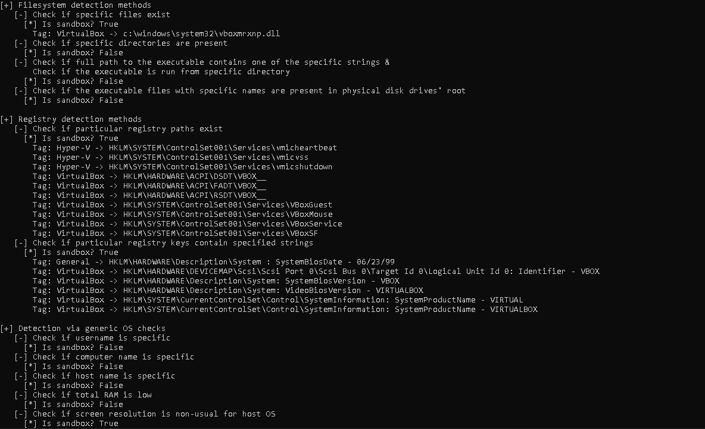

# SLib - Sanbox Evasion Library in C#

Slib is a C# library that contains various checks to try to identify if a computer is a sandbox or not.  

It is based on the methods defined by Checkpoint in the following link:
- https://evasions.checkpoint.com

# Implemented techniques
## Filesystem
- Check if specific files exist
- Check if specific directories are present
- Check if full path to the executable contains one of the specific strings
- Check if the executable is run from specific directory
- Check if the executable files with specific names are present in physical disk drives' root
## Registry
- Check if particular registry paths exist
- Check if particular registry keys contain specified strings
## Generic OS queries
- Check if username is specific
- Check if computer name is specific
- Check if host name is specific
- Check if total RAM is low
- Check if screen resolution is non-usual for host OS
- Check if number of processors is low
- Check if quantity of monitors is small
- Check if hard disk drive size and free space are small
- Check if system uptime is small
## Global OS objects
- Check for specific global mutexes
## UI artifacts
- Check if windows with certain class names are present in the OS
- Check if top level windows' number is too small
## OS features
- Checking debug privileges
## Processes
- Check if specific files exist
- Check if specific libraries are loaded in the process address space
- Check number of processes: 
## Network
- Check if MAC address is specific
- Check if adapter name is specific
- Check if network belongs to security perimeter
- Cuckoo ResultServer connection based anti-emulation technique
## Hardware
- Check if HDD has specific name
- Check if HDD Vendor ID has specific value
- Check if CPU temperature information is available

# Author
[@aetsu](https://twitter.com/aetsu)
